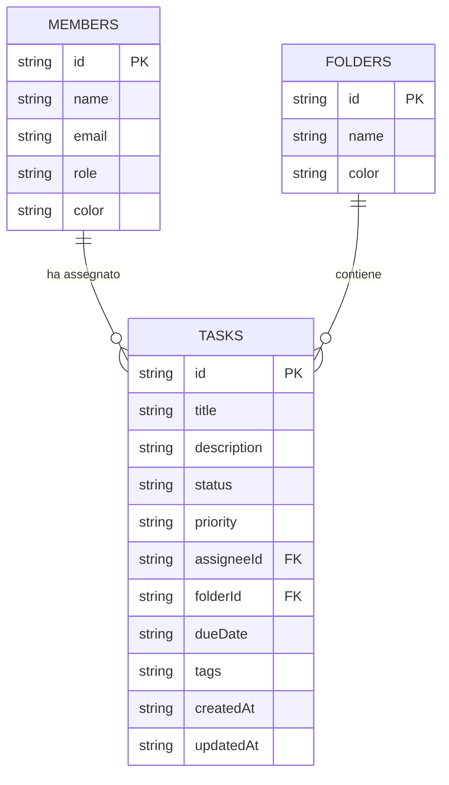

# Documentazione Database e API REST (TeamFlow)

Questa cartella contiene la componente di backend per l'applicazione TeamFlow, basata su **Node.js**, **Express** e **SQLite**.

---

## 1. Struttura delle Cartelle (Organizzazione del Codice)
Il codice è organizzato seguendo il pattern architetturale MVC (Model-View-Controller) per separare le responsabilità:

```text
server/
├── config/
│   └── db.js            # Connessione al database SQLite, tabelle e dati di seed.
├── controllers/
│   ├── foldersController.js  # Gestione delle cartelle (progetti).
│   ├── membersController.js  # Gestione dei membri del team.
│   └── tasksController.js    # Gestione delle attività.
├── database.sqlite      # File di database fisico SQLite (generato automaticamente).
├── DATABASE.md          # Questa documentazione.
└── index.js             # Entry point del server Express.
```

---

## 2. Schema del Database Relazionale (SQLite)

Il database è costituito da tre tabelle principali relazionate tra loro:



### Tabella `members`
Memorizza i dettagli dei membri del team.
*   `id` (TEXT, Chiave Primaria): Identificativo univoco (UUID).
*   `name` (TEXT): Nome e cognome.
*   `email` (TEXT): Indirizzo e-mail.
*   `role` (TEXT): Ruolo nel team (es. Developer, Designer).
*   `color` (TEXT): Colore esadecimale associato al membro per l'interfaccia.

### Tabella `folders`
Memorizza le cartelle o progetti per organizzare i task.
*   `id` (TEXT, Chiave Primaria): Identificativo univoco.
*   `name` (TEXT): Nome della cartella (es. "Sviluppo Frontend").
*   `color` (TEXT): Colore associato per evidenziare la cartella.

### Tabella `tasks`
Memorizza i dettagli dei singoli task.
*   `id` (TEXT, Chiave Primaria): Identificativo univoco.
*   `title` (TEXT): Titolo del task.
*   `description` (TEXT): Descrizione del task.
*   `status` (TEXT): Stato del task (`todo`, `in_progress`, `review`, `done`).
*   `priority` (TEXT): Priorità (`low`, `medium`, `high`, `urgent`).
*   `assigneeId` (TEXT, Chiave Esterna): Riferimento a `members.id`. Se il membro viene eliminato, questo campo viene impostato a `NULL`.
*   `folderId` (TEXT, Chiave Esterna): Riferimento a `folders.id`. Se la cartella viene eliminata, il task rimane orfano (`NULL`).
*   `dueDate` (TEXT): Data di scadenza (formato `YYYY-MM-DD`).
*   `tags` (TEXT): Stringa JSON che rappresenta l'array di tag (es. `'["design", "ui"]'`).
*   `createdAt` / `updatedAt` (TEXT): Timestamp in formato ISO.

---

## 3. Endpoint API REST

Tutti gli endpoint rispondono al prefisso `/api`.

### Cartelle (Folders)
*   `GET /api/folders`: Restituisce tutte le cartelle.
*   `POST /api/folders`: Crea una nuova cartella.
    *   *Body*: `{ "id": "...", "name": "...", "color": "..." }`
*   `PUT /api/folders/:id`: Aggiorna una cartella esistente.
*   `DELETE /api/folders/:id`: Elimina la cartella (imposta a `NULL` il `folderId` dei task correlati).

### Membri (Members)
*   `GET /api/members`: Restituisce tutti i membri.
*   `POST /api/members`: Crea un nuovo membro.
*   `PUT /api/members/:id`: Aggiorna un membro.
*   `DELETE /api/members/:id`: Elimina un membro (imposta a `NULL` l'assegnatario dei task correlati).

### Task
*   `GET /api/tasks`: Restituisce tutti i task (con i `tags` già deserializzati in array JSON).
*   `POST /api/tasks`: Crea un nuovo task.
*   `PUT /api/tasks/:id`: Aggiorna un task esistente.
*   `DELETE /api/tasks/:id`: Elimina un task.

### Sistema
*   `POST /api/reset`: Elimina tutti i dati correnti e inserisce nuovamente i dati di seed predefiniti.
